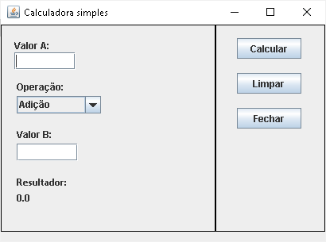

# Formulário para uma calculadora usando a IDE NetBeans.

## Contextualização

 - Esta é uma versão do sistema para a IDE NetBeans.  
 - O projeto no NetBeans deve ser chamado FrmCalculadora. 
 - Este programa possui diversas classes organizada nos pacotes, principal, visao e modelo. 
 - A pasta src contêm os fontes do projeto. 
 - A interface gráfica foi construída **com** o auxílio da IDE NetBeans. 

### Interface gráfica

## Arquivos

- pom.xml - Arquivo de configurção da ferramenta de automação Maven.